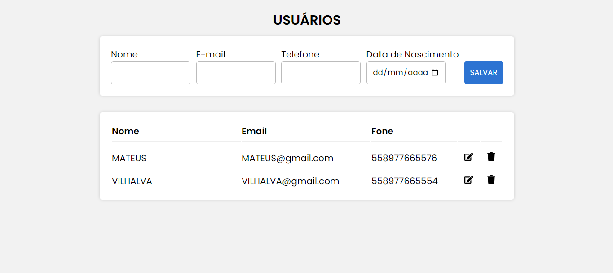
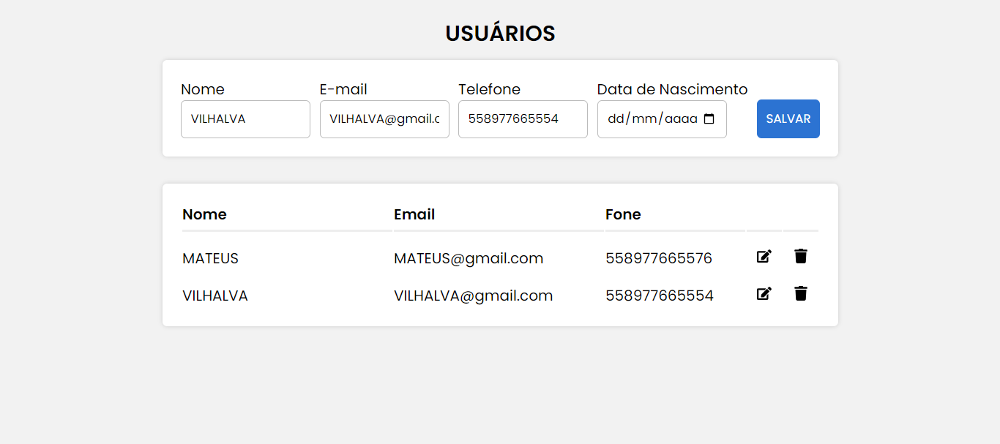
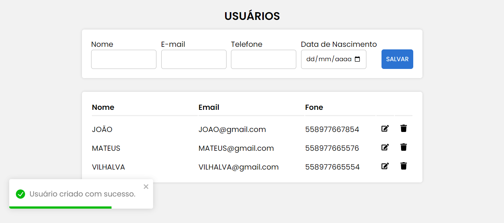
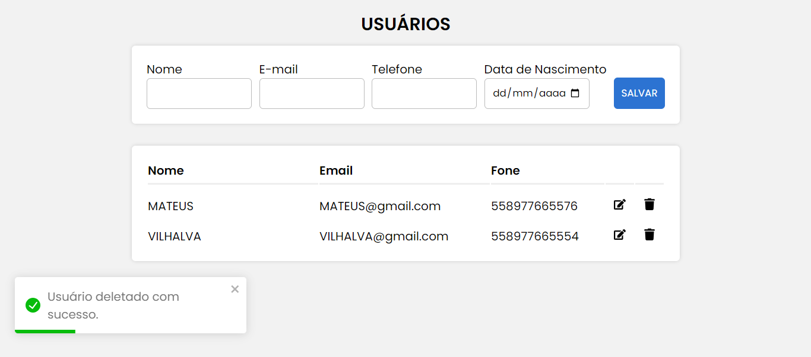
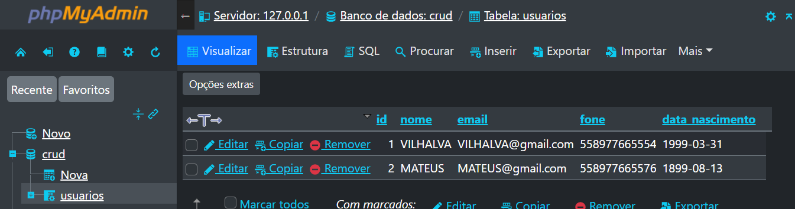

# CRUD DE USUARIO COM REACT
👨‍🏫APP DE CRUD DE USUÁRIOS QUE GERENCIA NOME, EMAIL, TELEFONE E DATA DE NASCIMENTO COM REACT E MYSQL!

 <br> 
 <br> 
 <br> 
 <br> 
 <br> 

## DESCRIÇÃO:
Este projeto é um aplicativo CRUD (Create, Read, Update, Delete) de usuários que gerencia informações como nome, email, telefone e data de nascimento. Ele utiliza React no frontend para criar uma interface de usuário interativa e MySQL como banco de dados para armazenar os dados dos usuários.

## FUNCIONALIDADES:
1. **Interface de Usuário com React:** O frontend do aplicativo é desenvolvido com React, fornecendo uma interface de usuário amigável para interagir com as operações CRUD.

2. **Banco de Dados MySQL:** Os dados dos usuários são armazenados em um banco de dados MySQL. O aplicativo utiliza consultas SQL para realizar operações CRUD no banco de dados.

3. **Operações CRUD:** O aplicativo permite criar novos usuários, visualizar informações de usuários existentes, atualizar os detalhes dos usuários e excluir usuários do banco de dados.

4. **Gerenciamento de Estado:** O estado da aplicação é gerenciado eficientemente para garantir uma experiência de usuário fluida e responsiva.

## EXECUTANDO O PROJETO:
1. **Configuração do Banco de Dados:**
   - Antes de executar o aplicativo, é necessário importar o arquivo `DATABASE.sql` que está localizado em `CODIGO/api`.

2. **Configuração do JS:**
   - Abra o arquivo em `./CODIGO/db.js` e ajuste as configurações do seu banco de dados:

     ```javascript
      host: "localhost",
      user: "seu_usuario",
      password: "sua_senha",
      database: "CRUD"
     ```

3. **Instalando as Dependências:**
   - Para instalar as dependências listadas no arquivo "package.json", você pode usar o comando `npm install` no terminal. Certifique-se de estar no diretório `CODIGO/api` e `CODIGO/frontend` e execute o seguinte comando:
   ```bash
   npm install
   ```

4. **Executando o Aplicativo:**
   - Para iniciar o servidor, você deve estar no diretório `CODIGO/api` e `CODIGO/frontend`. Abra dois terminais e execute o seguinte comando em cada um:
   ```bash
   npm start
   ```

   - Acesse o aplicativo no navegador visitando `http://localhost:3000/`.

5. **Interagindo com o Aplicativo:**
   Use a interface do usuário para adicionar, visualizar, atualizar e excluir usuários conforme necessário. Certifique-se de que o servidor MySQL esteja em execução e acessível para que o aplicativo possa se conectar e interagir com o banco de dados.

## NÃO SABE?
- Entendemos que para manipular arquivos em `HTML`, `CSS` e outras linguagens relacionadas, é necessário possuir conhecimento nessas áreas. Para auxiliar nesse aprendizado, oferecemos cursos gratuitos disponíveis:
* [CURSO DE HTML E CSS](https://github.com/VILHALVA/CURSO-DE-HTML-E-CSS)
* [CURSO DE REACT](https://github.com/VILHALVA/CURSO-DE-REACT)
* [CURSO DE MYSQL](https://github.com/VILHALVA/CURSO-DE-MYSQL)
* [CONFIRA MAIS CURSOS](https://github.com/VILHALVA?tab=repositories&q=+topic:CURSO)

## CREDITOS:
- [PROJETO CRIADO PELO "WilliamDosSantos"](https://github.com/WilliamDosSantos/CRUD-FullStack)
- [VEJA O VIDEO DESSE PROJETO](https://youtu.be/voXTVTW73E8?si=FWYiybBjLY-EImhk)
- [PROJETO EDITADO PELO VILHALVA](https://github.com/VILHALVA)


